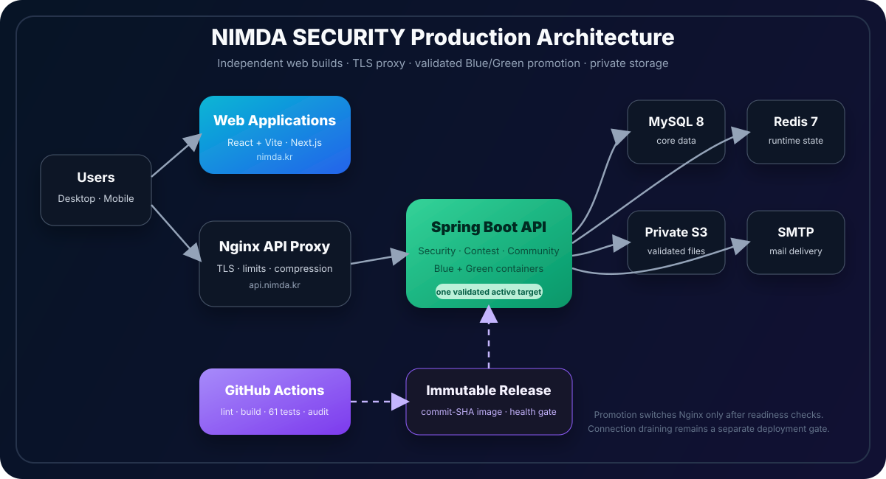

<p align="center">
  <a href="https://nimda.kr">
    
  </a>
</p>

<h1 align="center">NIMDA</h1>

<p align="center">
  NIMDA Security 동아리를 위한 대회·커뮤니티 통합 플랫폼입니다.
</p>

<p align="center">
  <a href="https://nimda.kr"><strong>Live App</strong></a> ·
  <a href="README.md">English</a> ·
  <a href="#주요-기능">주요 기능</a> ·
  <a href="#빠른-시작">빠른 시작</a> ·
  <a href="#라이선스와-저작권">라이선스</a>
</p>

<p align="center">
  <a href="https://github.com/Nimda-Security/Nimda/actions/workflows/ci.yml"></a>
  <a href="https://nimda.kr"></a>
  
  
  
  
  
</p>

---

## NIMDA란?

NIMDA는 NIMDA Security 동아리의 운영 웹 플랫폼입니다. 알고리즘 대회, 문제 풀이, 스코어보드, 회원 활동, 커뮤니티 게시판, 알림, 마일리지 보상, 관리자 기능을 하나의 서비스로 제공합니다.

## 주요 기능

- **대회**: 문제 목록, 문제 상세, 제출, 채점 현황, 스코어보드
- **커뮤니티**: 카테고리형 게시판, 댓글, 좋아요, 사진첩, 리치 텍스트, 첨부파일
- **회원**: 로그인, 회원가입, 프로필, 출석, 알림, 마일리지, 프로필 장식
- **관리자**: 회원 승인, 권한 관리, 게시판/카테고리/태그 관리, 마일리지 지급
- **운영**: Docker Compose, Nginx, MySQL, Redis, S3, CI, Blue-Green 무중단 배포

## 아키텍처

<p align="center">
  
</p>

NIMDA는 React 프론트엔드와 Spring Boot API 서버를 중심으로 구성됩니다. 운영 환경에서는 Nginx가 활성 Blue/Green 백엔드로 트래픽을 라우팅하고, GitHub Actions가 Docker 이미지를 빌드한 뒤 배포 스크립트를 실행합니다.

## 기술 스택

| 영역      | 스택                                                               |
| --------- | ------------------------------------------------------------------ |
| Frontend  | React 19, TypeScript, Vite 7, Tailwind CSS, Tiptap, Axios          |
| Backend   | Java 17, Spring Boot 3.2, Spring Security, Spring Data JPA, Flyway |
| Data      | MySQL 8.0, Redis 7, AWS S3                                         |
| Infra     | Docker Compose, Nginx, GitHub Actions, Blue-Green deployment       |
| 개발 도구 | Bruno API collection, load-test scripts, Prettier, ESLint          |

## 빠른 시작

### 요구 사항

- Node.js 20+
- Java 17
- Docker and Docker Compose

### 프론트엔드

```bash
cd NimdaConFrontEnd
npm install
npm run dev
```

### 백엔드

```bash
cd NimdaConBackEnd/backend-spring
./mvnw spring-boot:run
```

Windows에서는 `mvnw.cmd spring-boot:run`을 사용합니다.

### Docker Compose

루트에 `.env` 파일을 만든 뒤 실행합니다.

```bash
docker compose up -d
```

## 환경 변수

루트 `.env`는 Docker Compose와 운영 백엔드가 사용합니다.

| 변수                                     | 설명                               |
| ---------------------------------------- | ---------------------------------- |
| `MYSQL_ROOT_PASSWORD`                    | MySQL root 비밀번호                |
| `MYSQL_DATABASE`                         | 데이터베이스 이름, 예: `nimda_con` |
| `MYSQL_USER` / `MYSQL_PASSWORD`          | 애플리케이션 DB 계정               |
| `REDIS_PASSWORD`                         | Redis 비밀번호                     |
| `JWT_SECRET`                             | JWT 서명 키                        |
| `AWS_S3_BUCKET`, `AWS_S3_REGION`         | S3 버킷 설정                       |
| `AWS_S3_ACCESS_KEY`, `AWS_S3_SECRET_KEY` | S3 인증 정보                       |
| `MAIL_HOST`, `MAIL_PORT`                 | SMTP 서버                          |
| `MAIL_USERNAME`, `MAIL_PASSWORD`         | SMTP 인증 정보                     |

프론트엔드 환경 변수는 로컬 개발 시 필요할 때만 추가합니다.

| 변수                       | 기본값        |
| -------------------------- | ------------- |
| `VITE_API_BASE_URL`        | `/api`        |
| `VITE_SCOREBOARD_ENDPOINT` | `/scoreboard` |

`.env` 파일은 커밋하지 않습니다.

## 스크립트

| 명령어                                                     | 설명                           |
| ---------------------------------------------------------- | ------------------------------ |
| `npm run dev` in `NimdaConFrontEnd`                        | Vite 개발 서버 실행            |
| `npm run build` in `NimdaConFrontEnd`                      | 프론트엔드 빌드                |
| `npm run lint` in `NimdaConFrontEnd`                       | 프론트엔드 린트 실행           |
| `./mvnw test` in `NimdaConBackEnd/backend-spring`          | 백엔드 테스트 실행             |
| `./mvnw clean package` in `NimdaConBackEnd/backend-spring` | 백엔드 JAR 빌드                |
| `./deploy.sh status`                                       | Blue-Green 배포 상태 확인      |
| `./deploy.sh rollback`                                     | 대기 중인 백엔드 버전으로 롤백 |

## 배포

`main` 브랜치에 push되면 CI가 백엔드 이미지를 빌드하고 `latest` 및 commit hash 태그로 푸시합니다. 서버에서는 `deploy.sh`가 대기 중인 Blue/Green 컨테이너를 갱신하고 헬스체크 후 Nginx 라우팅을 전환합니다.

자세한 운영 절차는 [DEPLOYMENT.md](DEPLOYMENT.md)를 참고하세요.

## 디자인과 에셋

- 실제 서비스: [nimda.kr](https://nimda.kr)
- 대표 배너: `NimdaConFrontEnd/public/NimdaconBanner.png`
- 아키텍처 이미지: `assets/readme/framework.svg`
- 제품 및 브랜드 에셋은 프론트엔드와 랜딩 페이지의 `public` 디렉터리에 있습니다.

디자인 에셋, 로고, 배너, 스크린샷은 NIMDA 프로젝트의 자산이며, 유지보수자의 허가 없이 프로젝트 외부에서 재사용하면 안 됩니다.

## 기여자

아래 내용은 공개 GitHub PR/commit 기록을 기준으로 주요 영역을 요약한 것입니다.

| 영역     | 범위                                                   | 기여자                                                                         |
| -------- | ------------------------------------------------------ | ------------------------------------------------------------------------------ |
| Frontend | 핵심 화면, MyPage, 프로필/배지, 포인트 상점, 알림 UI   | [@nuyoes](https://github.com/nuyoes)                                           |
| Frontend | 관리자/마일리지 화면 연동, 댓글/유저 상세 관련 FE 수정 | [@maenggeon](https://github.com/maenggeon)                                     |
| Frontend | 스코어보드·게시판 초기 화면, S3 첨부 흐름 연동         | [@YknowsGit](https://github.com/YknowsGit)                                     |
| Frontend | 랜딩 페이지 인트로와 비주얼 개선                       | [@JungBlue](https://github.com/JungBlue), [@nuyoes](https://github.com/nuyoes) |
| Frontend | 포인트 요약, 사이드바 이미지, 인증/세션 UX             | [@xtkww971](https://github.com/xtkww971)                                       |
| Backend  | Spring Security, CI, 테스트/운영 기반                  | [@novvvv](https://github.com/novvvv)                                           |
| Backend  | 포인트, 출석, 알림, 좋아요, Redis/JWT, 배포            | [@xtkww971](https://github.com/xtkww971)                                       |
| Backend  | 댓글, 게시판 권한, 관리자 회원/마일리지 API            | [@maenggeon](https://github.com/maenggeon)                                     |
| Backend  | 대회/스코어보드, 게시판 초기 도메인, S3 첨부파일       | [@YknowsGit](https://github.com/YknowsGit)                                     |
| Backend  | 비밀번호 복구와 MCP 연동                               | [@JungBlue](https://github.com/JungBlue)                                       |

## 라이선스와 저작권

현재 이 저장소에는 루트 레벨 오픈소스 라이선스 파일이 포함되어 있지 않습니다. 라이선스가 추가되기 전까지 소스 코드, 서비스 디자인, 로고, 배너, 이미지, 기타 프로젝트 자산의 저작권은 NIMDA Security에 있으며 모든 권리가 보유됩니다.

## 저장소 구조

```text
Nimda/
├── NimdaConFrontEnd/              # React + Vite application
├── NimdaConBackEnd/backend-spring # Spring Boot API server
├── NimdaLandingPage/              # Next.js landing page
├── bruno/                         # API request collection
├── load-tests/                    # Load-test scripts and results
├── nginx/                         # Nginx routing configuration
├── docker-compose.yml             # Runtime services
└── deploy.sh                      # Blue-Green deployment script
```
